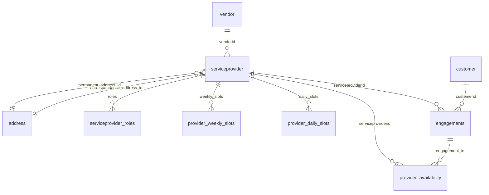

# Serveaso Providers API

Backend service for **service providers**, **customers**, and **vendors** in the Serveaso platform. It exposes REST APIs for onboarding and managing providers (including roles, availability, and nanny care types), geo-based discovery, monthly availability analysis, and supporting checks for email and mobile uniqueness.

---

## Tech stack

| Layer | Choice |
|--------|--------|
| Runtime | Node.js (ES modules) |
| HTTP | Express 5 |
| ORM | Sequelize 6 (PostgreSQL) |
| Raw SQL | `pg` connection pool (heavy geo / availability queries) |
| API docs | OpenAPI 3 via `swagger-jsdoc` + `swagger-ui-express` |
| Dates / TZ | `dayjs` with UTC and `Asia/Kolkata` |
| Metrics | Prometheus (`prom-client`) |
| Config | `dotenv` |

---

## Quick start

```bash
npm install
cp .env.example .env   # if you maintain one; see Environment variables below
npm run dev            # nodemon
# or
npm start              # node src/server.js
```

- **API base:** `http://localhost:4000` (or `PORT` from env)
- **Swagger UI:** `http://localhost:4000/api-docs`
- **Health:** `GET /`
- **Prometheus scrape:** `GET /metrics`

---

## Environment variables

| Variable | Purpose |
|----------|---------|
| `PORT` | HTTP port (default `4000`) |
| `NODE_ENV` | `production` enables PostgreSQL SSL in Sequelize (`src/config/database.js`) |
| `DB_PORT` | Postgres port (default `5432`) |
| `NEARBY_MONTHLY_MAX_CANDIDATES` | Cap providers evaluated in `POST /nearby-monthly` (default `100`, clamped 50–2000) |
| `NEARBY_MONTHLY_MAX_EXCEPTIONS_PER_PROVIDER` | Max `exceptions[]` entries returned per provider in monthly response (default `36`, clamped 12–62) |

**Database credentials and host** are currently defined in `src/config/database.js` and in the raw `pg` pool inside `src/routes/provider.routes.js`. For non-local deployments, move these to environment variables and inject them in both places so Sequelize and the geo routes stay aligned.

---

## API surface

### Service providers — `/api/service-providers`

| Method | Path | Description |
|--------|------|-------------|
| `GET` | `/providers` | Paginated or full list of providers (hydrated with addresses where applicable) |
| `GET` | `/serviceprovider/:id` | Provider by `serviceproviderid` + addresses |
| `POST` | `/serviceprovider/add` | Create provider: addresses, **`housekeepingRoles`** (required), optional `weeklySlots` or `timeslot`, `languages` → `languageKnown`, `nannyCareType`, KYC fields, `agentReferralId` → `vendorId`, etc. |
| `PUT` | `/serviceprovider/:id` | Update provider; optional `housekeepingRoles` replaces `serviceprovider_roles`; `timeslot` / `weeklySlots` rebuild weekly + daily slot tables; `languages` / `agentReferralId` mapped like create |
| `GET` | `/nearby` | Date/time-aware nearby search (query params: `lat`, `lng`, `date`, `startTime`, `role`, optional `radius`) |
| `POST` | `/nearby-monthly` | Body: geo, `role`, `radius`, `startDate` / `endDate`, `preferredStartTime`, `serviceDurationMinutes`, optional pagination (`page`, `limit`), optional **`customerID`** (positive integer only — `0` is ignored). Returns per-provider monthly summary, booking-sourced debug counts, optional previous-booking flags |
| `POST` | `/check-email` | Whether email exists on customer or service provider |
| `POST` | `/check-mobile` | Whether mobile exists (provider route implementation) |

**Provider domain highlights**

- **Roles:** Canonical list is **`housekeepingRoles`** (array). Persisted in `serviceprovider_roles`; legacy column `housekeepingRole` is kept in sync (typically first role). Nearby search matches junction roles, with a fallback when the junction omits the searched role but `housekeepingRole` matches.
- **Nanny care:** `nannyCareType` is an array of free-form string codes (or a comma-separated string), stored in column `nannycaretypes` as comma-separated text. See migration `sql/add_nannycaretypes_column.sql`.
- **Availability:** On create, `weeklySlots` or parsed `timeslot` populate `provider_weekly_slots` and seed `provider_daily_slots` for a forward window. On update, sending `timeslot` and/or `weeklySlots` replaces weekly rows and rebuilds future daily rows.
- **Nearby-monthly:** Uses bounding-box prefilter, haversine distance, parallel DB reads, IST calendar walks, merges `provider_availability` with engagement fallbacks, and ranks primarily by **distance** so partially available nearby providers are not pushed past arbitrarily “greener” far listings. Response may truncate `exceptions` with `exceptionsTotal` / `exceptionsTruncated`.

### Customers — `/api`

| Method | Path | Description |
|--------|------|-------------|
| `GET` | `/customer/:id` | Customer by id |
| `GET` | `/customers` | Paginated list |
| `POST` | `/customer` | Create customer |
| `PUT` | `/customer/:id` | Update customer |

### Vendors — `/api`

| Method | Path | Description |
|--------|------|-------------|
| `POST` | `/vendor/add` | Create vendor |
| `GET` | `/vendors` | List vendors |
| `GET` | `/vendor/:id` | Vendor by id |
| `PUT` | `/vendor/:id` | Update vendor |

Full request/response shapes are described in **Swagger** (`/api-docs`) and in JSDoc under `src/swagger/*.js` and route files.

---

## Database (ERP) and how tables connect

The app uses **PostgreSQL** as the system of record. In platform terms this database behaves as the **ERP / operational datastore**: it holds master entities (vendors, providers, customers, addresses), provider capability and schedule data, and **booking / assignment** data used for availability and monthly search.

Some entities are fully mapped with **Sequelize**; others are only queried with **raw SQL** in `provider.routes.js` because they belong to the broader booking domain.

### Sequelize-mapped tables (core models)

| Table | Model / file | Primary key | Main relationships |
|-------|----------------|-------------|-------------------|
| **vendor** | `Vendor` (`vendor.model.js`) | `vendorid` | One vendor → many **serviceprovider** rows (`serviceprovider.vendorid`). |
| **serviceprovider** | `Provider` (`provider.model.js`) | `serviceproviderid` | Belongs to **vendor** (`vendorid`, optional in DB for some rows). Two FKs to **address**: `correspondence_address_id`, `permanent_address_id` → `address.id`. Legacy role string `housekeepingRole`; extended care in `nannycaretypes` (API: `nannyCareType`). |
| **serviceprovider_roles** | `ServiceProviderRole` | Composite (`serviceproviderid`, `role`) | Many roles per provider; canonical role list for search and onboarding. |
| **address** | `Address` (`address.model.js`) | `id` | Shared address rows; providers point here for correspondence and permanent address. |
| **provider_weekly_slots** | `ProviderWeeklySlot` | `id` (surrogate) | `serviceproviderid` → **serviceprovider**; recurring weekly windows (`day_of_week`, `slot_start`, `slot_end`). |
| **customer** | `Customer` (`customer.model.js`) | `customerid` | Customer master data (used by customer APIs and referenced from **engagements** in raw SQL). |

**Declared Sequelize associations** (`src/model/index.js`): `Vendor.hasMany(Provider)`, `Provider.belongsTo(Vendor)`, `Provider.hasMany(ServiceProviderRole)`, `ServiceProviderRole.belongsTo(Provider)`.  
Provider ↔ Address is via **foreign key columns** on `serviceprovider` only (no `Provider.belongsTo(Address)` in `index.js` today).

### Operational tables (raw SQL, booking / calendar)

These tables are central to **nearby**, **nearby-monthly**, and slot generation. They are not all registered as Sequelize models in this repo but must exist in the same database.

| Table | Role | How it links |
|-------|------|----------------|
| **engagements** | Bookings / engagements (monthly, short-term, on-demand, etc.) | `serviceproviderid` → provider, `customerid` → customer, `engagement_id` PK. Drives assignment status, date range, epochs, duration. |
| **provider_availability** | Calendar slots per provider/date (e.g. BOOKED) | `serviceproviderid`, `date`, optional `engagement_id` → **engagements**, epoch columns for overlap logic. |
| **provider_daily_slots** | Concrete daily open slots | Generated from **provider_weekly_slots** (+ `generate_series`) when providers are created or availability is refreshed; `serviceproviderid` → **serviceprovider**. |

**Typical flow:** onboarding writes **serviceprovider**, **address**, **serviceprovider_roles**, **provider_weekly_slots**, then SQL seeds **provider_daily_slots**. The booking pipeline writes **engagements** and **provider_availability**; nearby-monthly reads **provider_availability** (BOOKED) and falls back to **engagements** when PA is sparse.

### Relationship overview (diagram)



### SQL migrations shipped in this repo

Run on your Postgres instance as needed:

| File | Purpose |
|------|---------|
| `sql/add_serviceprovider_roles.sql` | Creates **serviceprovider_roles** and backfills from legacy data where applicable. |
| `sql/add_nannycaretypes_column.sql` | Adds **nannycaretypes** on **serviceprovider** for nanny care type strings. |
| `sql/add_nearby_monthly_perf_indexes.sql` | Optional indexes to speed up geo/role and booking joins for `/nearby-monthly`. |

---

## Observability: Prometheus & Grafana

The app exposes **Prometheus** metrics and ships a **Grafana** dashboard JSON that expects those series to be scraped with the job name **`providers-app`**.

### What the app exposes

| Endpoint | Description |
|----------|-------------|
| `GET /metrics` | Prometheus text exposition format (`Content-Type` from `prom-client`) |

**Instrumentation in code**

| Piece | Role |
|-------|------|
| `src/middleware/requestMetrics.js` | Per-request timing; on `res.finish`, records duration and status |
| `src/monitoring/prometheus.js` | Registers metrics and helpers |
| `src/middleware/errorHandler.js` | Increments `api_errors_total` via `observeApiError` |
| `src/controllers/customer.controller.js` | Increments `provider_actions_total` via `observeProviderAction` (customer CRUD outcomes) |

**Metric names** (labels vary by `method`, `route`, `status_code`, etc.)

| Name | Type | Purpose |
|------|------|---------|
| `http_request_duration_ms` | Histogram | Request latency (ms) |
| `http_requests_total` | Counter | Request count |
| `api_errors_total` | Counter | Handled API errors |
| `provider_actions_total` | Counter | Customer-controller action outcomes |
| Default Node metrics | Various | CPU, memory, event loop, etc. (`collectDefaultMetrics`) |

**Route label:** Express may report parameterized paths (e.g. `/serviceprovider/:id`) once the route is matched; unmatched paths fall back to `req.path`.

---

### Prometheus setup

1. Run the API (default port **4000** unless `PORT` is set).
2. Confirm metrics: `curl -s http://localhost:4000/metrics | head`
3. Install Prometheus (binary, Kubernetes, or Docker — see below).
4. Configure a **scrape job** that:
   - Hits `http://<api-host>:<port>/metrics`
   - Uses **`job_name: providers-app`** (or equivalent `job` label **`providers-app`**) so the bundled Grafana panels match.

**Example config:** copy `monitoring/prometheus.yml.example` to `monitoring/prometheus.yml` and adjust `targets` (e.g. `127.0.0.1:4000` if Prometheus runs on the same machine as Node, or `host.docker.internal:4000` if Prometheus runs in Docker on Mac/Windows).

**Quick local stack (Docker Compose)**

```bash
cd monitoring
cp prometheus.yml.example prometheus.yml   # edit targets if your API port/host differs
docker compose -f docker-compose.observability.yml up -d
```

- **Prometheus UI:** http://localhost:9090 — open **Status → Targets** and ensure `providers-app` is **UP**.
- **Query example:** `rate(http_requests_total{job="providers-app"}[5m])`

---

### Grafana setup

1. **Install Grafana** (or use the Compose file above — Grafana listens on **3000**, default login `admin` / `admin`).
2. **Add a Prometheus datasource**
   - URL: `http://localhost:9090` if Grafana runs on the host, or **`http://prometheus:9090`** if Grafana is in the same Compose network as Prometheus.
   - Save and test.
3. **Datasource UID (important for the import)**  
   The dashboard JSON references `uid: "prometheus"`. In Grafana: **Connections → Data sources → Prometheus →** set **UID** to `prometheus` (may require enabling “Advanced” / editing JSON in newer Grafana versions). If you use another UID, edit the dashboard panels to point at your datasource or re-select the datasource after import.
4. **Import the dashboard**
   - **Dashboards → New → Import → Upload JSON**
   - File: `monitoring/grafana/dashboards/providers-api-dashboard.json`
   - Title: **Providers API Monitoring** (`uid: providers-api-monitoring`)

**Panels included**

| Panel | PromQL idea |
|-------|-------------|
| Request rate (5m) | `sum by (method, route) (rate(http_requests_total{job="providers-app"}[5m]))` |
| P95 latency by route | `histogram_quantile(0.95, sum by (le, route) (rate(http_request_duration_ms_bucket{job="providers-app"}[5m])))` |
| API errors (5m) | `sum by (code, route) (rate(api_errors_total{job="providers-app"}[5m]))` |
| Provider actions (5m) | `sum by (action, result) (rate(provider_actions_total{job="providers-app"}[5m]))` |

If your Prometheus job name is not `providers-app`, either change `job_name` in `prometheus.yml` or replace `job="providers-app"` in the dashboard JSON / panel queries.

---

## Project layout

```
src/
  app.js                 # Express app, routes, /metrics, Swagger, CORS, JSON
  server.js              # Starts HTTP server, loads dotenv
  config/database.js     # Sequelize connection
  controllers/           # HTTP handlers → services
  middleware/            # errorHandler, requestMetrics
  model/                 # Sequelize models
  routes/                # provider, customer, vendor routers
  services/              # Business logic (transactions, slots, roles)
  swagger/               # OpenAPI aggregation + shared components
  utils/                 # pagination, response helper, logger
  monitoring/prometheus.js
monitoring/
  prometheus.yml.example          # Scrape config template (job: providers-app)
  docker-compose.observability.yml # Optional local Prometheus + Grafana
  grafana/dashboards/
    providers-api-dashboard.json  # Import into Grafana
sql/                     # DBA-run migrations / indexes
```

---

## Error handling

API errors flow through `src/middleware/errorHandler.js`, which respects `err.statusCode` when set (e.g. validation `400` from provider create/update).

---

## Scripts

| Script | Command |
|--------|---------|
| Start | `npm start` |
| Dev (watch) | `npm run dev` |
| Tests | Not wired yet (`npm test` placeholder) |

---

## License

ISC (see `package.json`).
